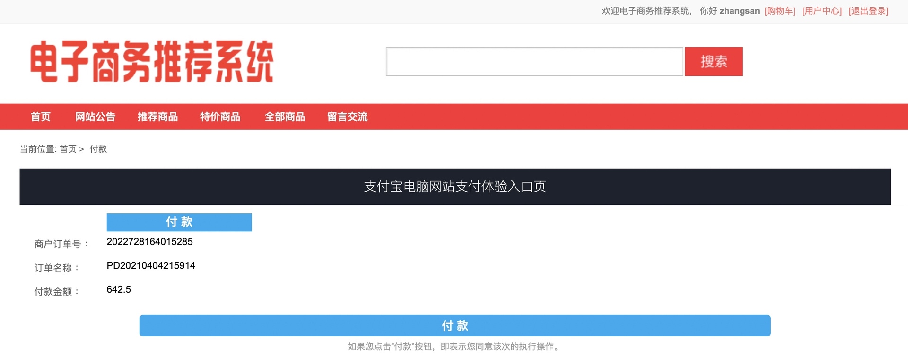
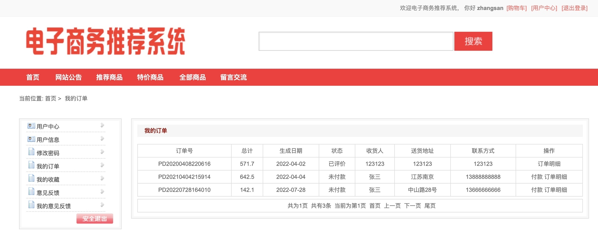
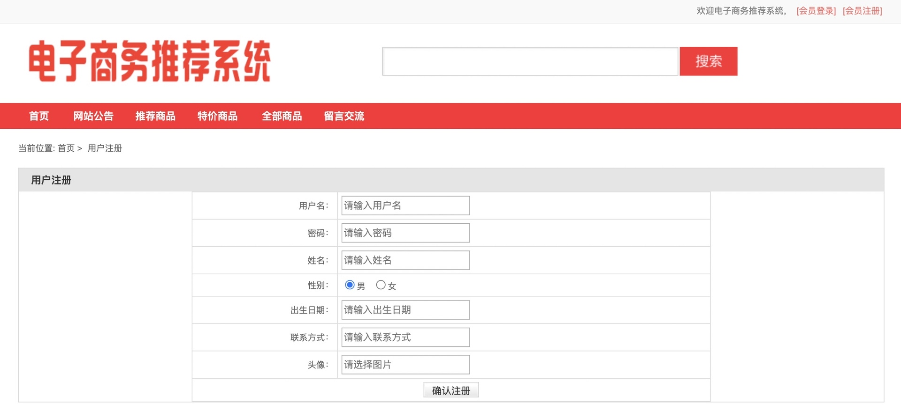
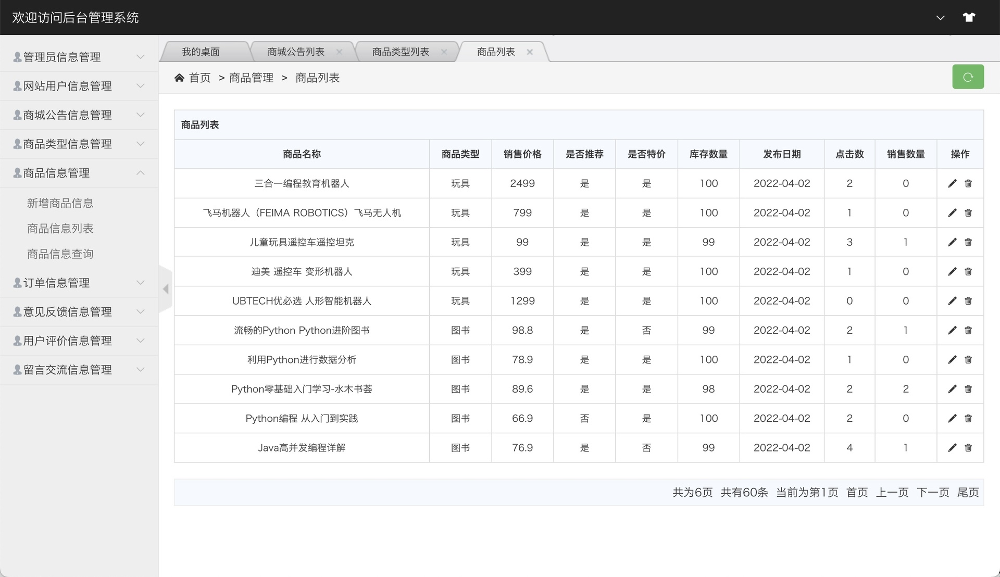
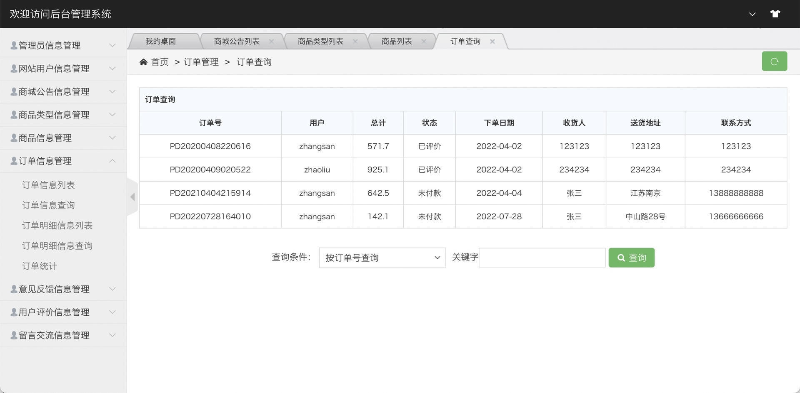

## 基于SSM的电子商务推荐系统

###  获取sql数据库文件: 从戎源码网 (https://armycodes.com/) QQ: 386869957 QQ群: 377586148
###  所有系统地址: (https://github.com/YuLin-Coder/AllProjectCatalog) 
###  所有项目以及源代码本人均调试运行无问题 可支持远程安装部署调试、定制修改、代码讲解

## 项目介绍
基于SSM的电子商务推荐系统,系统分为前台和后台两大模块，主要功能如下。
系统主要功能包括：用户登录、用户注册、商品展示、网站公告、推荐商品、猜你喜欢、商品管理、商品类型管理、订单管理、意见反馈管理、用户评价管理、留言交流管理、基于用户过滤的协同算法、智能推荐商品等

## 项目技术
- 编程语言：Java
- 数据库：MySQL
- 前端技术：JSP、JavaScript、JQuery
- 后端技术：Spring、SpringMVC、MyBatis

## 运行环境
- JDK版本：JDK1.8及以上
- 开发工具：IDEA、Ecplise、Myecplise都可以
- 数据库: MySQL5.7及以上
- Maven：maven3.0及以上

## 运行截图

